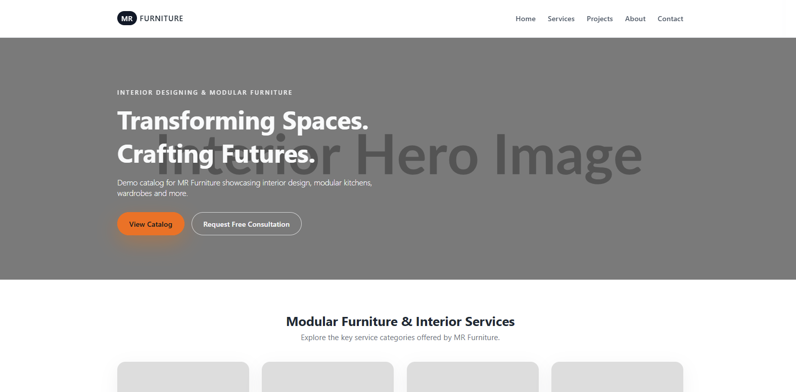

# Custom-Catalog – Interior Design & Modular Furniture Portfolio Theme

## 📖 Overview

Custom-Catalog is a WordPress Theme built using a custom starter theme. This theme is specifically designed for interior design companies, modular furniture manufacturers, and catalog-based businesses. It features a clean, modern design with dynamic content loading, custom post types for projects, ACF integration for flexible content management, and WooCommerce compatibility.

🔗 **Live Demo:** [Add your live demo URL here]

---

## 🚀 Key Features

- **Dynamic Content:** Custom post types for projects with taxonomy-based filtering
- **Custom Post Types (CPT):** Project CPT with Service taxonomy for categorization
- **ACF Integration:** Advanced Custom Fields for flexible content management including contact settings and project galleries
- **WooCommerce Overrides:** Full support for WooCommerce plugin integration
- **Custom Templates:** Front-page, single project, service taxonomy archive, and more
- **Search + Pagination:** Built-in search functionality with pagination support
- **Widget Areas:** Sidebar widget area for additional content
- **Frontend Framework/Styling:** Pure CSS with modern responsive design

---

## 🛠 Tech Stack

**Frontend**
- Pure CSS with modern styling
- HTML5 semantic markup
- JavaScript for interactive elements (Swiper slider, navigation)
- Responsive design with mobile-first approach

**Backend**
- PHP
- WordPress Theme API
- Advanced Custom Fields (ACF)
- Custom Post Types and Taxonomies
- WP_Query for custom content retrieval

**Database**
- MySQL / MariaDB

**Required Plugins**
- Advanced Custom Fields (ACF)
- Contact Form 7 (optional for contact forms)
- WooCommerce (optional for e-commerce functionality)

---

## ⚙️ Template Hierarchy Used

- **front-page.php** – Custom homepage with hero section, services grid, project catalog, and contact form
- **single-project.php** – Single project display with gallery slider, project details, and related projects
- **taxonomy-service.php** – Service category archive showing projects filtered by service type
- **archive.php** – Default archive template for post types
- **functions.php** – Theme setup, ACF field groups, custom functions, and enqueue scripts/styles

(*Remove unused items automatically*)

---

## 🔧 Installation

1. Download the repository.
2. Move the theme folder into:

/wp-content/themes/custom-catalog

3. Go to **WordPress Admin → Appearance → Themes**
4. Activate: **Custom-Catalog**
5. Install required plugins:
   - Advanced Custom Fields (ACF)
   - Contact Form 7 (optional)
   - WooCommerce (optional)

---

## 📸 Screenshots

> Add actual screenshot paths.

### Homepage

### Single Project

###Thumbnail Screenshot

---

## 📝 Author

**Your Name**
WordPress Theme Developer

🔗 Portfolio: [https://karanbhanushali-portfolio-cms.netlify.app/]
🔗 LinkedIn: [(https://www.linkedin.com/in/karan-bhanushali/)]

---

## 📄 License

This project is licensed under the **GPL-2.0** license.
See the `LICENSE.md` file for details.
